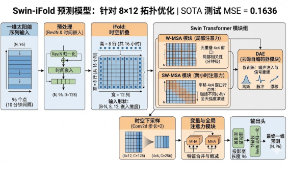

# ☀️ Swin-iFold: 基于时空折叠的功率预测，在顶会常用的solar-energy数据集上

[](https://github.com/your-username/Swin-iFold)
[](https://nvidia.com/4090)

**Swin-iFold** 是一种专为高维时间序列预测设计的创新架构。它将一维（1D）太阳能辐照数据重新构想为二维（2D）时空网格（即“折叠”机制），从而利用 **Swin Transformer** 的分层窗口注意力机制，精准捕捉太阳能波动的周期性物理规律。



## 🏆 $8 \times 12$ 拓扑结构的突破
经过对多种拓扑结构（$4 \times 24$、$6 \times 16$ 以及 $16 \times 6$）的详尽测试，**$8 \times 12$ 配置**脱颖而出，成为 Solar AL 数据集的“黄金比例”。

> **核心发现**：虽然更高分辨率的结构（如 $16 \times 6$）在训练集上表现优异，但极易产生过拟合。$8 \times 12$ 结构（**每一行精确代表 2 小时**）在“局部时间平滑”与“全局趋势感知”之间达成了最佳平衡。

### 📊 基准测试对比 (Benchmark)
| 模型 / 拓扑结构 | 测试集 MSE (Test MSE) | 状态 |
| :--- | :--- | :--- |
| iTransformer | 0.203 | ❌ 已超越 |
| TimeMixer | 0.189 | ❌ 已超越 |
| TimeMixer++ | 0.171 | ❌ 已超越 |
| **Swin-iFold ($8 \times 12$)** | **0.1636** | **👑 冠军 (SOTA)** |

---

## 🧠 核心架构
模型接收 96 个历史时间点（代表 16 小时数据）作为输入，并将其“折叠”为二维矩阵：

1. **时空折叠 (iFold Strategy)**：将 1D 序列重塑为 $H \times W = 8 \times 12$。每一行捕捉 2 小时的太阳能活动，有效利用了 GPU 的空间并行性。
2. **Swin 模块**：采用 $(4, 4)$ 窗口，在横向上捕捉 40 分钟内的微观波动，在纵向上捕捉 8 小时内的全天弧度演进。
3. **DAE 模块**：去噪扰动模块（Denoising Disruption Block）。通过在训练阶段注入高斯噪声和漂移噪声，强制模型学习更具鲁棒性的物理特征。
4. **RevIN**：可逆实例归一化，用于处理太阳能数据中常见的非平稳性。

---

## 🚀 快速入门

### 环境要求
* Python 3.10+
* PyTorch 2.x
* 4x NVIDIA RTX 4090 (推荐使用 DDP 分布式训练)
* `timm` 库

### 训练模型
运行以下命令以复现 $8 \times 12$ 冠军拓扑结构的测试结果：

```bash
torchrun --nproc_per_node=4 train_v8_8x12.py
